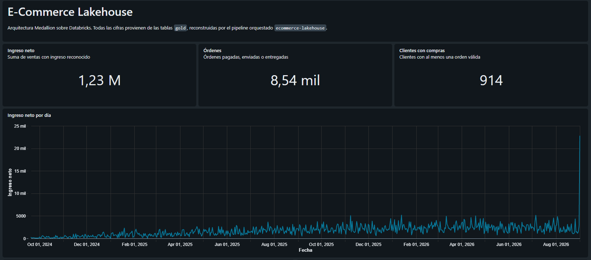
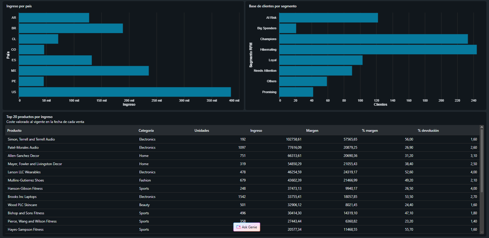
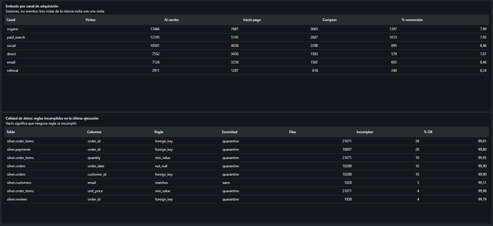

# Databricks E-Commerce Lakehouse

[](https://github.com/GabrielPy28/databricks-ecommerce-lakehouse/actions/workflows/ci.yml)

*[Español](README.md) · English*

> The primary documentation for this project is in Spanish, and so are the
> comments and docstrings in the source. This page is a complete translation of
> the Spanish README for English-speaking readers.

End-to-end lakehouse for an e-commerce platform, built on Databricks Free
Edition with a Medallion architecture, incremental processing, data quality as
code and version-controlled orchestration.

This is not a notebook that transforms a CSV. It is a pipeline that runs on its
own, halts when the data fails to meet a minimum bar, and whose figures
reconcile to the cent against the layer they came from.

```
Generator (local container, no Spark)
        │  Parquet, one batch at a time
        ▼
UC Volume  ecommerce.landing.raw/<entity>/batch_NNN/
        │  Auto Loader · availableNow trigger
        ▼
BRONZE   append-only · schema preserved · lineage metadata
        │  try_cast · quality rules · MERGE · SCD2
        ▼
SILVER   business keys · deduplicated · history · quarantine
        │  aggregation · windowed reload
        ▼
GOLD     seven business-facing data products
        │
        ├──▶ Databricks SQL · AI/BI dashboard
        └──▶ Churn model (separate job, off the critical path)
```

---

## The problem it solves

An e-commerce platform receives customers, products, orders, order lines,
payments, reviews, returns and clickstream events every day. The data arrives
**dirty, duplicated and out of order**: the source system re-emits records, an
order changes status several times, and some records show up days after the
fact.

The pipeline has to produce figures the business can trust, and it has to keep
doing so when it is re-run, when late-arriving data shows up, and when an
extract comes through corrupt.

---

## The result

A Databricks AI/BI dashboard, defined as code in [`dashboards/`](dashboards/)
and deployed by the same bundle as the pipeline. Every figure comes from the
`gold` tables.



Cumulative net revenue, orders with recognised revenue, and customers with at
least one purchase, over 24 months of history. *The spike on the final day is
the incremental batch: its 153 orders all carry the generator's reference date,
against roughly 13 on any given day of history.*



Revenue by country, RFM segmentation of the customer base, and the top 20
products by revenue. Each product's margin is computed with the **cost in
effect on the date of each sale**, taken from the SCD2 history — this is where
that investment pays off.



The funnel counts **sessions, not events**. And the dashboard carries its own
data quality: which rules were violated in the last run, how many rows, at what
severity. A business figure without its quality next to it asks you to trust it
blindly.

---

## How to run it

All development happens inside a container. There is no need to install Python,
Java or the Databricks CLI on the host machine.

```bash
cp .env.example .env          # then fill in DATABRICKS_HOST and DATABRICKS_TOKEN
docker compose build

docker compose run --rm dev pytest                        # 294 tests, no workspace needed
docker compose run --rm dev python scripts/run_sql.py sql/00_bootstrap.sql

# Generate and publish a batch
docker compose run --rm dev python -m ecommerce.generator.cli \
    --profile dev --seed 42 --out data/batches --batch 0
docker compose run --rm dev databricks fs cp -r --overwrite \
    data/batches dbfs:/Volumes/ecommerce/landing/raw

# Deploy and run the pipeline
docker compose run --rm dev databricks bundle deploy --target dev
docker compose run --rm dev databricks bundle run ecommerce_pipeline --target dev

# Optional phases, each its own job, run by hand
docker compose run --rm dev databricks bundle run churn_model --target dev
docker compose run --rm dev databricks bundle run time_travel_demo --target dev
```

You do not pass a batch number: Auto Loader ingests every new file it finds, and
each row is tagged with the batch **from its own path**.

---

## The decisions that define the project

### Data lands as text, not typed

The raw files have **every column as `string`**. That is not an oversight: a
Parquet column typed as `timestamp` cannot hold an invalid date, so a generator
that emitted already-typed data would make it impossible to reproduce the very
scenario Silver has to solve. `schemas/` defines the typed logical contract;
Silver's job is to rebuild it.

### `try_cast`, not `cast`

Spark 4 enables ANSI mode by default: an invalid `cast` raises and **aborts the
entire job**. A single corrupt record among millions would take the pipeline
down. `try_cast` turns it into a null and quarantine picks it up.

### Quarantine, not discard

A row that fails conversion or a rule is not dropped — losing it silently is
worse than not processing it. It is set aside in
`silver.<entity>_quarantine` along with the exact reason, and it is
reprocessable.

### Idempotency by construction

Re-running the pipeline over the same data changes nothing:

| Mechanism | Where |
|---|---|
| Auto Loader checkpoint | Bronze does not re-ingest files it already processed |
| `MERGE` with `s.updated_at > t.updated_at` | Silver neither duplicates nor reverts |
| Full rewrite of quarantine | Rejected rows do not accumulate |
| Deleting from Silver what is rejected today | A new rule withdraws what was already published |
| `replaceWhere` by window | Gold rewrites only what is affected |

That same `MERGE` condition solves **late-arriving data**: a record that belongs
to the past but arrives now does not revert the current state.

### Quality rules are configuration, not code

51 rules declared in [`rules.yml`](src/ecommerce/quality/rules.yml). You can
answer "what does this pipeline check?" by reading one file, and add a check
without touching Python. Three severities:

- `warn` — log it and let it through
- `quarantine` — set the row aside with its reason
- `fail` — **halt the pipeline**

A rule can be scoped to a subset with `where`, and some cases cannot be
expressed any other way. `web_events.product_id` allows nulls — viewing the home
page is an event without a product — but the other three funnel steps cannot
lack one: a purchase with no product is an impossible record that would
contaminate `product_performance`. The rule checks **43,601 events** and leaves
out the 58,399 home-page views.

`row_count_delta` is the only rule that looks at the whole table, and it catches
what no per-row rule can see: data that is **missing**. An absent row violates
nothing — it simply is not there — so a pipeline that one day ingests a fraction
of the usual volume passes every validation and publishes silently incomplete
figures. The baseline comes from the history in `ops.quality_results`:

```
10,200 rows, no baseline to compare against       ← first run
10,200 -> 10,200 rows (+0.0%, threshold ±30%)     ← the next one
```

The quality gate is a separate task in the DAG, and `build_gold` depends on it
rather than on Silver. If quality fails, Gold never gets to publish figures
built on data that does not clear the bar.

### SCD Type 2 where meaning changes

`customers` and `products` keep history. This is not decoration:
`order_items.unit_price` already preserves the sale price, but **cost** and
**country** do not. Without history, a customer who moves retroactively rewrites
the revenue of two countries, and a change in purchase price invents margin
across the entire past.

Gold joins each fact to the dimension version **in effect on the date of the
fact**, not the current one.

### The pipeline and the dashboard are code

The DAG, its parameters, its environment and its schedule live in
[`databricks.yml`](databricks.yml). The dashboard lives in
[`dashboards/`](dashboards/). Both are reviewable in a pull request and
rebuildable if someone deletes them.

The code in `src/` reaches the jobs as a **wheel** that the bundle builds and
installs; `src/` is excluded from the workspace sync so no notebook can
accidentally import an unversioned copy.

### The model is evaluated against the alternative of not having it

A churn model is easy to build and easy to get wrong: if the features are
computed over the whole history, they contain the answer and AUC climbs to 0.99
without the model predicting anything. Here the features only look at data up to
a cutoff, the label only at what comes after, and evaluation happens at a
different cutoff from training.

And every metric is published alongside the **trivial rule** the business
already applies without a model. The number that matters is not 0.789 — it is
the gap to 0.683.

---

## Measured results

Every figure comes from real runs on Databricks Free Edition, `dev` profile, two
batches (initial load plus one incremental).

### Full traceability of a batch

```
Bronze raw           10,530   ← what arrived, preserved as-is
Bronze distinct      10,200   ← 30 duplicates and 300 status mutations
Silver valid         10,180
Silver quarantine        20   ← 10 unparseable dates + 10 non-existent customers
```

**10,180 + 20 = 10,200.** The sum reconciles exactly and no order appears as both
valid and quarantined. Every row is accounted for; none was lost silently.

### Gold ↔ Silver reconciliation

| Gold | Silver | Difference |
|---|---|---|
| 1,233,217.10 | 1,233,217.10 | **0.00** |

The aggregate can be recomputed from its source and comes out the same. Without
that, a dashboard is an unsupported claim.

### Orchestrated pipeline timings

| Task | Duration |
|---|---|
| `ingest_bronze` | 151 s |
| `build_silver` | 189 s |
| `quality_gate` | 22 s |
| `build_gold` | 122 s |
| **Total** | **484 s** |

Full load of both batches on serverless compute. Timings vary between runs
depending on the state of the warehouse.

### Data generation

| Profile | Rows | Time |
|---|---|---|
| `dev` | 144,000 | < 2 s |
| `demo` | 7,180,000 | 27 s |

Faker builds the pools of names and brands; vectorised numpy produces the facts.
Faker row by row over millions of orders would take hours.

### Data quality

51 rules across 8 tables. In the last run, **69 violations**, every one traceable
to a deliberately injected anomaly:

| Rule | Rows | Origin |
|---|---|---|
| `orders.customer_id` foreign_key | 10 | Injected orphans |
| `orders.order_date` not_null | 10 | Unparseable dates |
| `order_items.quantity` min_value | 10 | Non-positive quantities |
| `order_items.unit_price` min_value | 4 | Negative prices |
| `customers.email` matches (warning) | 5 | Malformed addresses |
| `order_items.order_id` foreign_key | 17 | **Cascade** |
| `payments.order_id` foreign_key | 10 | **Cascade** |
| `reviews.order_id` foreign_key | 3 | **Cascade** |

The last three are an emergent effect: setting 20 orders aside left their lines,
payments and reviews orphaned. That is what actually happens when a parent record
is rejected, and it is now visible instead of hidden.

### Dimension history

```
customers   1,018 versions   1,000 current
products      206 versions     200 current
```

Intervals with no gaps and no overlaps: a version's `valid_to` is exactly the
next one's `valid_from`.

### Performance: a design error, measured and corrected

The first version partitioned the Gold tables by their date column. Measuring the
physical layout with `DESCRIBE DETAIL` made it clear this was a mistake:

| Table | Files before | After | Size before | After |
|---|---|---|---|---|
| `daily_sales` | **698** | **1** | 1.60 MB | 10.8 KB |
| `marketing_funnel` | **721** | **1** | ~2.4 MB | 34.3 KB |
| `category_performance` | 25 | 1 | ~60 KB | 4.5 KB |
| **Total** | **1,444** | **3** | | |

`daily_sales` had **one row per file**: 698 days, 698 partitions, files of
2.2 KB. One partition per day over a table of daily aggregates creates one
partition per row.

**`OPTIMIZE` did not fix it**, and that was the most useful finding: it compacts
*within* each partition, and with a single file per partition it has nothing to
do. It did not even leave an entry in the table history. The problem was not a
lack of compaction but over-partitioning.

The fix is **liquid clustering**: it groups by the same column without slicing up
storage, so data skipping still works and files are a reasonable size.
`replaceWhere` remains valid because it operates on data columns, not just
partition columns.

The drop in size — from 1.60 MB to 10.8 KB in `daily_sales` — is not magic: with
one row per file, the Parquet footer, the schema and the per-column statistics
weigh more than the data. With 698 rows together, columnar compression finally
has something to work with.

#### Why layout is measured instead of time

Two earlier attempts to measure with `read_bytes` failed, and it is worth saying
why:

1. The warehouse's **disk cache** returned 0 bytes read after `OPTIMIZE` — which
   leaves the files it just wrote warm — and declared a 100% improvement that did
   not exist.
2. Restarting the warehouse to flush it, the `read_bytes` and `read_files`
   columns in `system.query.history` still read zero: they are enriched with more
   delay than the script could wait for.

Physical layout depends on neither caches nor latency. That is the measure that
gets published. Wall-clock times are deliberately omitted: on serverless they
mostly measure the state of the warehouse.

### Recovery with time travel

[`notebooks/99_time_travel_demo.py`](notebooks/99_time_travel_demo.py) does not
narrate the scenario — it runs it. It breaks `gold.daily_sales` with a plausible
error (a factor applied to the revenue of a date range), confirms that **the job
completes successfully** while publishing the inflated figure, quantifies the
damage, and recovers.

| Version | State | Revenue |
|---|---|---|
| 11 | Correct | 1,233,217.10 |
| 12 | Broken by the `UPDATE` | **1,326,096.40** |
| 14 | Restored | 1,233,217.10 |

**244 days affected**, and not one exception: just a figure that does not add up.
The final `assert` verifies the recovery, and reconciliation against Silver comes
back to 0.00.

`RESTORE` **adds** a version rather than erasing history, so v12 is still there:
you can audit what was published and for how long.

Two details the demo learned the hard way:

- On Free Edition with Default Storage, `DESCRIBE DETAIL` returns an empty
  `location`. Path-based time travel fails; you have to use `VERSION AS OF` by
  name.
- The first version split breaking and restoring across separate cells. One
  failed in between and **left the table inflated**; the next run took that state
  as the good one. The destructive part now sits in a `try`/`finally`, and the
  notebook starts by reconciling against Silver: it refuses to run against an
  already-corrupt table.

### Marketing funnel

```
page_view        58,399   100.00 %
add_to_cart      26,461    45.31 %
checkout_start   12,413    21.25 %
purchase          4,727     8.09 %
```

### Churn prediction

An optional phase, in a separate job: it **consumes** Gold and is not on the
critical path. If the model fails, the business tables still get published.

The risk with a churn model is not predicting badly — it is predicting *too
well*. Defining churn as "no purchases in 90 days" and feeding the model
`days_since_last_order` computed over the whole history yields an AUC of 0.99 and
a useless model: it has been handed the answer. Here the features are computed
**only from data up to a cutoff** and the label looks **strictly after it**, with
two cutoffs so that validation is **out-of-time**:

```
features (≤ 2026-03-05) → label (2026-03-05 .. 2026-06-03]   training
                          features (≤ 2026-06-03) → label (.. 2026-09-01]   test
```

The test that holds all of this up does not check a number: it adds activity
after the cutoff and requires that **not one feature changes**.

Result over 896 test customers, 36.8% churned:

| Model | AUC-ROC | AUC-PR |
|---|---:|---:|
| **Logistic regression** (selected) | **0.789** | **0.638** |
| Random forest | 0.789 | 0.629 |
| Gradient boosting | 0.779 | 0.620 |
| *Baseline: recency rule* | *0.683* | *0.544* |

The baseline is not decoration: it is what the business already knows how to do
without a model ("hasn't bought in a long time, they're leaving"). Publishing
0.789 without that 0.683 next to it is marketing, not evaluation. The real
improvement is **+0.106 AUC-ROC**.

The 914 actionable predictions are computed at the latest available cutoff —
customers whose 90 days have not yet elapsed, and who therefore **have no
label** — and grouped by risk decile:

| Band | Customers | Mean prob. | Mean recency | Orders | Mean spend |
|---|---:|---:|---:|---:|---:|
| high (top decile) | 92 | 0.656 | 323 d | 1.0 | 166 |
| medium (next 20%) | 182 | 0.496 | 145 d | 2.2 | 302 |
| low | 640 | 0.139 | 53 d | 12.6 | 1,817 |

Two things the table shows that are worth not papering over:

- **The bands are by decile, not by absolute threshold.** The first version cut
  at 0.7 and left 3 customers out of 914 in "high": with a 37% prevalence the
  model almost never exceeds that. A retention team has fixed capacity and calls
  the top N it can handle.
- **Risk and value point in opposite directions.** The highest-risk decile
  accounts for 15,275 of historical spend out of 1,233,217 — 1.2%. They are
  single-order buyers. "Call the most likely" and "protect the most revenue" are
  not the same list, and a campaign that ignores this will spend its budget on
  the cheapest customers to lose.

The metrics are stored in `ops.model_metrics` with their cutoffs and prevalence.
A number that only lives in a notebook's output is gone the moment someone runs
it again.

---

## Tests

294 tests that run **without a connection to Databricks**, in the same container
CI uses.

| Suite | What it protects |
|---|---|
| `test_environment` | That the image has Python 3.12, Java, Spark, Delta and the modern CLI |
| `test_config`, `test_schemas` | Data contract, scale profiles |
| `test_generator`, `test_incremental` | Determinism, referential integrity, mutations, late data |
| `test_ingestion` | Auto Loader options and lineage metadata |
| `test_transformations`, `test_scd2` | Typing, quarantine, idempotent MERGE, history |
| `test_quality` | Every rule type passes and fails when it should |
| `test_analytics`, `test_gold_tables` | The business figures, computed by hand |
| `test_bundle` | The DAG, the dashboard and their references |
| `test_ml_features`, `test_ml_churn` | Absence of label leakage, and that the model beats the trivial rule |

The transformations live in `src/` as pure `DataFrame → DataFrame` functions and
the notebooks are **thin drivers** that only chain them together. Without that
separation, `tests/` would be decorative.

---

## Layout

```
src/ecommerce/
├── config.py              scale profiles, namespace
├── schemas/               data contract (source of truth)
├── generator/             Faker + numpy, mutations, controlled dirt
├── ingestion/             Auto Loader → Bronze
├── transformations/       typing, MERGE, SCD2, quarantine
├── quality/               rules engine + rules.yml
├── analytics/             Gold builders
└── ml/                    churn features and model (optional phase)

notebooks/                 thin drivers (00..05, 99 time travel)
dashboards/                AI/BI dashboard as code
sql/                       namespace bootstrap and analytical queries
scripts/                   utilities: SQL, run summary, measurement
tests/                     294 tests
docs/                      architecture, data model, decisions
```

---

## Technologies

| Piece | Use |
|---|---|
| Databricks Free Edition | Platform, serverless compute |
| PySpark 4.1.1 | Distributed processing |
| Delta Lake 4.3.1 | ACID, time travel, `MERGE`, `replaceWhere` |
| Unity Catalog | Catalog, schemas and Volumes |
| Auto Loader | Idempotent incremental ingestion |
| Databricks Workflows | DAG orchestration |
| Databricks Asset Bundles | Infrastructure as code |
| Databricks SQL | Warehouse and AI/BI dashboard |
| scikit-learn | Churn model (optional phase) |
| Faker + numpy | Synthetic data generation |
| Docker | Reproducible environment |
| pytest + ruff + GitHub Actions | Tests and CI |

---

## Scope and limitations

Deliberate decisions, not omissions:

- **Single currency (USD).** `country` is kept for segmentation; there is no FX
  conversion.
- **No continuous streaming.** Auto Loader with `availableNow` gives streaming
  semantics without permanently consuming quota.
- **`lifetime_value` is historical spend, not a prediction.** A predictive CLV
  needs a model; calling a non-existent model "lifetime value" produces figures
  nobody can defend. What *is* a prediction lives in
  `gold.customer_churn_predictions`, and comes with its evaluation attached.
- **The model is neither registered nor served.** There is no MLflow Model
  Registry and no inference endpoint: the ML phase exists to show that the Gold
  layer feeds a real use case, not to build an MLOps platform.
- **Performance measured as physical layout, not wall-clock time or bytes
  read.** On serverless you do not control the compute, so time mostly measures
  platform noise; and bytes read are distorted by the disk cache and by the
  latency of `system.query.history`. File count and average size depend on
  neither.
- **100% synthetic data.** No real personal information.
